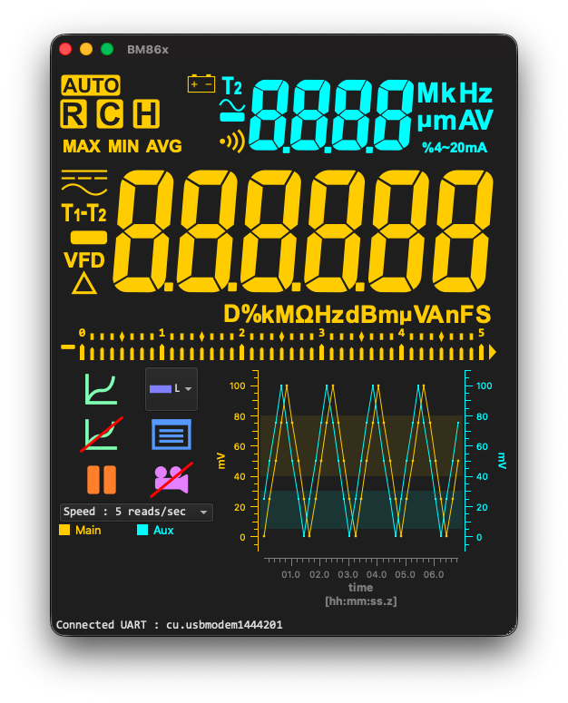
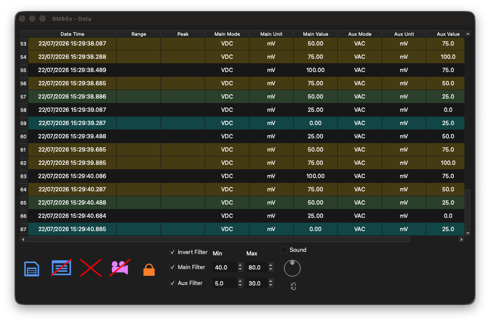

# Multimeter Data Logger for Brymen BM86x Series

A Qt-based application for monitoring, plotting, recording, and exporting data from Brymen BM86x Series digital multimeters.

*Brymen® is a registered trademark of its respective owner. This project is independent software and is not affiliated with, sponsored by, or endorsed by Brymen.*

## Overview

This application provides a graphical interface to connect to a multimeter, display measurements in real time, visualize data on a graph, record measurements, and export acquired data for further analysis.

The application supports communication through a serial connection and TCP/IP networking.

Communication between the computer and the multimeter requires a simple optical interface consisting of:

- an IR LED,
- an IR phototransistor,
- two resistors,
- a supported microcontroller board.

Assembly instructions and firmware are available in the [firmware](https://github.com/Tykyo/qt-brymen-86x-firmware) submodule.

## How to clone this repository

This repository contains multiple Git submodule.

To clone everything in a single step, use:

```bash
git clone --recurse-submodules https://github.com/Tykyo/qt-brymen-86x.git
```

If you have already cloned the repository without the submodule, initialize it afterwards with:

```bash
git submodule update --init --recursive
```

## Firmware

Communication with the multimeter requires the custom interface cable available in the `firmware` submodule.

The firmware currently supports the following platforms:

- Arduino (UNO, nano, mega) : Serial port
- Raspberry Pi Pico : USB-CDC Serial port
- STM32 (F103, F411) : USB-CDC Serial port
- ESP32, ESP32C3-mini, ESP32S3 : Wifi TCP socket (with debug on Serial port)

The firmware can be built using PlatformIO.

## Features

### Device Communication

* Connect and disconnect from the multimeter.
* Support for serial communication.
* Support for TCP/IP network connections.
* Display received measurement data in real time.

### Data Visualization

* Real-time graph display of measured values.
* Multiple graph display modes:

  * Curve plot
  * Line plot
  * Scatter plot
* Adjustable time scale.
* Customizable graph colors.
* Optional antialiasing.
* Pause and resume graph display without stopping data acquisition.
* Export graphs to:

  * PDF
  * SVG
  * PNG

### Data Recording

* Record measurements in a data table.
* Review acquired measurements.
* Clear recorded data.
* Export data to:

  * XLSX
  * CSV
* Print measurement tables.

### Filtering and Monitoring

* Primary and auxiliary data filtering.
* Configurable filter ranges.
* Optional audible notification when values match filter criteria.
* Adjustable notification volume.

### Additional Tools

* LCD display test.
* Reset application settings.
* Integrated user documentation.

## Screenshots




## Requirements

* Qt 6.x
* C++17 compatible compiler
* Supported operating system:

  * Linux
  * macOS
  * Windows

## Build

### Using Qt Creator

1. Open the project file in Qt Creator.
2. Select an appropriate Qt 6 kit.
3. Configure the project.
4. Build and run.

### Command line (Linux, MacOS)

Example:

```bash
mkdir build
cd build
qmake ..
make
```

### Windows / MSVC build note
When building the project on Windows with MSVC, the build may occasionally fail while compiling the Qwt library.
By default, Qt Creator uses `jom` to run several compilation jobs in parallel. Windows Defender may temporarily lock a file while scanning it, causing `jom` to report a build error.
A workaround is to use `nmake` instead of `jom` and let MSVC handle parallel compilation itself by passing the following option to qmake:
```text
QMAKE_CXXFLAGS+=/MP
```
In Qt Creator, configure the project to use nmake as the make tool and add QMAKE_CXXFLAGS+=/MP to the qmake configuration.

This keeps the compilation parallel while avoiding the file-locking issue that can sometimes occur with jom.

## Installation

The project provides a custom **`deploy`** target. This target creates an **`install`** folder within the build directory containing the application and all required libraries.

On macOS, the deployment folder contains a `.app` bundle and a `.dmg` package.

### Using Qt Creator

The `deploy` target can be integrated directly into Qt Creator.

Open your project's **Build Settings** and add a new **Build Step**:

* **Step:** `Make`
* **Arguments:** `deploy`

The deployed application can then be run on systems without a Qt development environment installed.

### Command line (Linux, macOS)

Run:

```bash
make deploy
```

The `deploy` target is intended for creating a distributable package. It does not install the application system-wide.

## Configuration

Application settings are stored using the Qt settings system.

The **Help > Clear Settings** menu action removes the stored configuration and restores default values.

## License

This project is released under the MIT License.

Copyright (c) 2026 Olivier Verlaine

See the `LICENSE` file for details.

## Third-party libraries

BM86x uses the following open source libraries:

- Qt 6 — GNU Lesser General Public License (LGPL) version 3
- Qwt — Qwt License (LGPL with exceptions)
- QXlsx — MIT License
- miniaudio — Public Domain / MIT-0

The corresponding license texts are available in the `licenses/` directory.

## Contributing

Bug reports, feature requests, and improvements are welcome.

Before submitting changes, please ensure that:

* The project builds successfully.
* Existing functionality is not broken.
* Code follows the existing project style.
