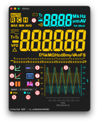
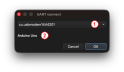
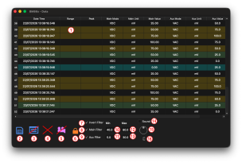

# User Guide

This guide provides an overview of the application features and explains the main controls.

## Main Features

* **Device > Connect**: Connect to the multimeter.
* **Device > Disconnect**: Disconnect from the multimeter.
* **Plot > Scale**: Select the time range displayed on the graph.
* **Plot > Type**: Select the graph display mode.
* **Plot > Color…**: Change the color of the selected graph element.
* **Plot > Antialiasing**: Adjust graph smoothing.
* **Plot > Save**: Save the graph in PDF, SVG, or PNG format.
* **Plot > Pause**: Pause or resume graph display.
* **Plot > Clear**: Clear the graph.
* **Plot > Print**: Print the graph.
* **Plot > B&W Save/Print**: Flag to set Black and White color on svae and print (Main: solid line, Aux: dashed line).
* **Plot > Hide**: Flag to hide/show plot and controls.
* **Data > Export**: Export multimeter data to an XLSX or CSV file.
* **Data > Review**: Open the window containing recorded multimeter data.
* **Data > Clear**: Clear all recorded data.
* **Data > Record**: Enable or disable data recording.
* **Data > Print**: Print the data table.
* **Help > Test LCD**: Run a display test for the multimeter screen.
* **Help > Clear Settings**: Clear the application's configuration data.
* **Help > Help**: Display this help documentation.

> **Tip:** Many menu actions have keyboard shortcuts.

## Notes

* The application communicates with the multimeter through a serial port or a TCP/IP connection.
* Available features depend on the connected multimeter model.
* The acquisition rate is limited by the capabilities of the multimeter.
* Recorded data can be exported for further analysis.

---

## Main Window

1. Displays data received from the multimeter.
2. Graph of measured values over time.
3. Save the graph in PDF, SVG, or PNG format.
4. Clear the graph. This action does not clear the data table.
5. Pause or resume graph display. Data acquisition continues, and missing points are displayed when the graph is resumed.
6. Select the graph display mode: curve, line, or scatter plot.
7. Show or hide the data table.
8. Start or stop data recording.
9. Enable or disable display of primary data on the graph.
10. Enable or disable display of auxiliary data on the graph.
11. Select the data acquisition speed. The available values depend on multimeter limitations.

---

## Connection Window

1. Select the serial port connected to the multimeter. A TCP/IP mode is also available for network connections.
2. Displays information about the currently selected serial port.

---

## Data Window

1. Data table. Rows are highlighted when measured values match the selected filter criteria.
2. Save the table in XLSX or CSV format.
3. Clear all table data.
4. Close the window.
5. Start or stop data recording.
6. Enable or disable table scroll lock.
7. Invert the data filter selection.
8. Enable or disable the primary data filter.
9. Enable or disable the auxiliary data filter.
10. Set the minimum value of the primary filter range.
11. Set the maximum value of the primary filter range.
12. Set the minimum value of the auxiliary filter range.
13. Set the maximum value of the auxiliary filter range.
14. Enable or disable the audible beep when a value matches a filter range.
15. Select the beep volume level (range: 0–20).
16. Display the current beep volume level.

## Using the Plot

You can interact directly with the plot using the mouse.

🖱️ **Left mouse button + drag**
Select an area to **zoom in** (zoom stack).

🖱️ **Right mouse button**
Go back to the **previous zoom level** (zoom stack).

🖱️ **Ctrl + right mouse button**
**Reset the zoom** and return to the full view (zoom stack).

🖱️ **Middle mouse button + drag**
**Pan the plot** to move the visible area.

🖱️ **Mouse wheel**
Zoom in or out along the **Y axis**.

⇧ **Shift + mouse wheel**
Zoom in or out along the **X axis**.

⌃/⌘ **Ctrl/Cmd + mouse wheel**
Zoom in or out along **both X and Y axes**.

⌥ **Alt + mouse wheel**
Scroll horizontally through the X axis to browse previous or later data.

---
Application version: 1.0.3
Documentation version: 1.0
---
Copyright (c) 2026 Olivier Verlaine  
SPDX-License-Identifier: MIT